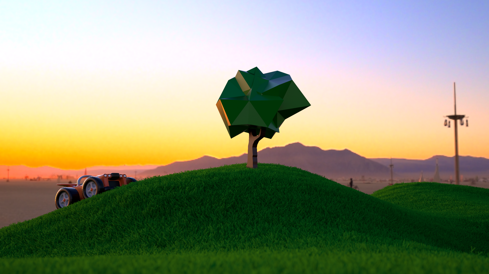

#SLR: 

  
IBL image: [sIBL Archive](http://www.hdrlabs.com/sibl/archive.html)  

SLRはモンテカルロレイトレーシングに基づいたレンダラーです。  
SLR is a renderer based on Monte Carlo ray tracing.  

SLRは次の要素から構成されています。  
SLR consists of the following components.  
* libSLR - レンダリングコア / rendering core
* libSLRSceneGraph - シーン管理・読み込み機能 / scene managing & loading
* HostProgram

##特徴 / Features
* Full Spectral Rendering (Monte Carlo Spectral Sampling)  
  (For RGB resources, RGB->Spectrum conversion is performed using Meng-Simon's method [1].)
* RGB Rendering
* Various BSDF Types (including Mixed and ~~Layered~~ (under Dev.) BSDF)
* Image Based Environmental Light
* Bump Mapping (Normal Map)
* Depth of Field
* Camera / Object Motion Blur
* Geometry Instancing
* Binned SAH BVH
* Unidirectional Path Tracing \[2\] with MIS
* Bidirectional Path Tracing \[3\]
* ~~Adaptive MCMC Progressive Photon Mapping~~ \[4\]  
  (current implementation is buggy and does not support IBL.)
* SLR Custom Language (C/Python-like syntax) for flexible scene description

[1] "Physically Meaningful Rendering using Tristimulus Colours", 2015  
[2] "THE RENDERING EQUATION", 1986  
[3] "Bidirectional Estimators for Light Transport", 1994  
[4] "Robust Adaptive Photon Tracing Using Photon Path Visibility", 2011

##動作環境 / Confirmed Environment
現状以下の環境で動作を確認しています。  
I've confirmed that the program runs correctly on the following environment.

* OS X 10.11
* Windows 8.1
* MacBook Pro Retina Late 2013

動作させるにあたっては以下のライブラリが必要です。  
It requires the following libraries.

* OpenEXR 2.2
* libpng 1.6
* assimp 3.2

##注意 / Note
モデルデータやテクスチャーを読み込むシーンファイルがありますが、それらアセットはリポジトリには含まれていません。

There are some scene files loading a model data and textures, but those assets are NOT included in this repository.

----
2016 [@Shocker_0x15](https://twitter.com/Shocker_0x15)
